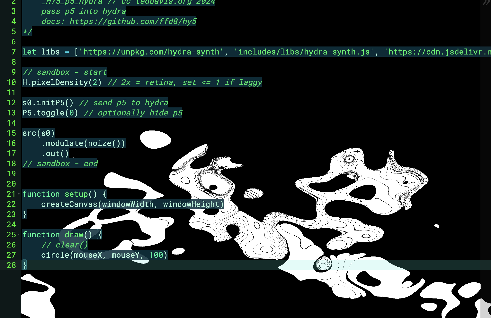
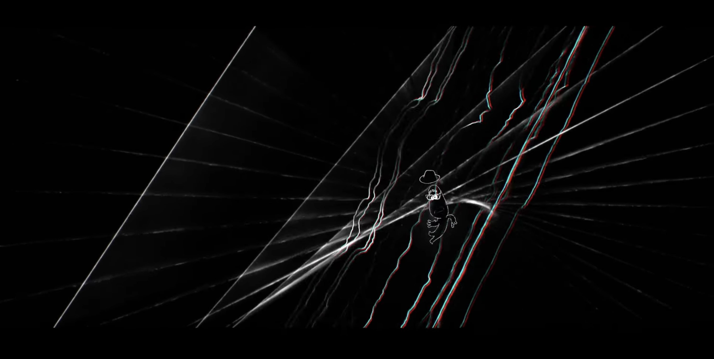
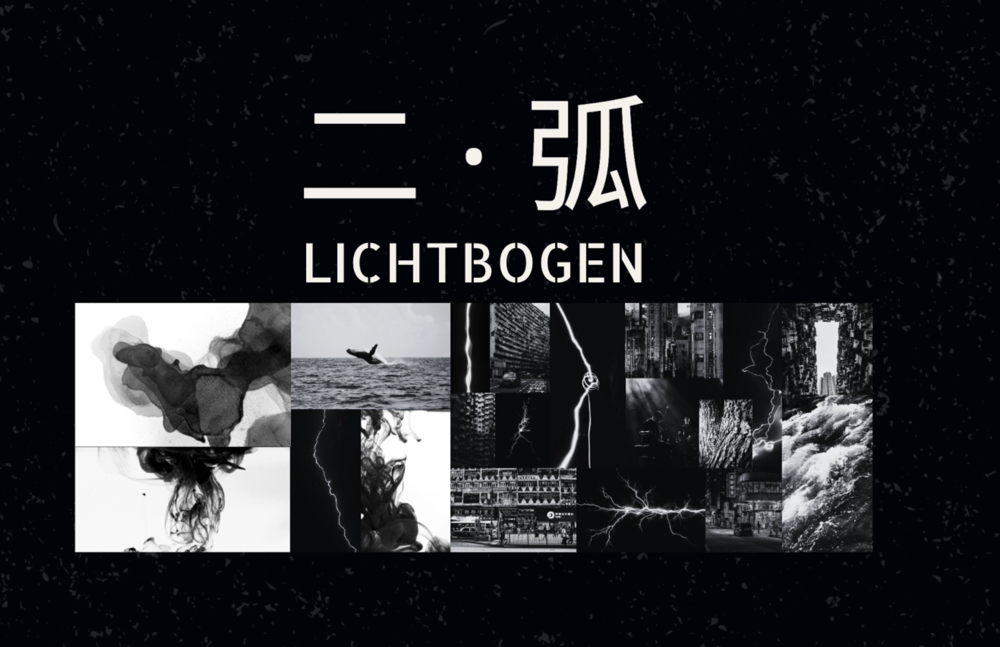

# [LMSC-261: Final Project] 
# Concert Visuals for 'Lichtbogen' with p5.js and P5LIVE

### Overview
A audio-reactive/cursor-controlled interactive concert visuals for my artistic direction project 'Lichtbogen' on p5.js and P5LIVE.

### Resources 
1) [Audio Reactive p5.js](https://editor.p5js.org/DK_Donkey_Kong/sketches/VuYkL2bcQ)
2) [Cursor interaction](https://happycoding.io/tutorials/p5js/input)
3) [PSLIVE: HY5_Hydra](https://teddavis.org/p5live/)

+more visual references below

### Paragraph Overview 
For my final project, I am planning to create an interactive concert visuals for my artistic direction passion project 'Lichtbogen'(description below) on p5.js and P5LIVE. Interested in pursuing a career in creative direction creaitng multimedia concerts, I want to preparing myself the required empathy and professionalism in communication with art collaborators as well as experiencing the creative process of visual media programming to make more techincal comments supporting my aesthetics pursuit in the future. The final project will be creating visuals for an original music I made with my friends, Daven, back in 2025 Summer. (Audio Reference: [Untitled, Daven Dubois](https://ycerhu.github.io/)) In my imagination for the music, I am aiming to include elements including 'whale', 'water movement', 'rising bubbles', 'chinese ink', and 'star night'. My job for the project will be creating the objects representing these elements and try to animate them, or even creating a cursor-controlled/audio reactive interactive protocal, and develop it to motion-captured in the future.

### Outcomes
##### GOOD: 
Creating animated looping/randomized visuals for 'Untitled, Daven Dubois' on p5.js: containing elements 'whale', 'water movement', rising bubbles'; and textures ' chinese ink' and 'start night'
##### BETTER: 
Creating cursor-controlled interactive visuals for 'Untitled, Daven Dubois' on p5.js and P5LIVE: containing elements 'whale', 'water movement', rising bubbles'; and textures ' chinese ink' and 'start night'
##### BEST: 
Creating audio-reactive visuals for 'Untitled, Daven Dubois' on p5.js and P5LIVE: containing elements 'whale', 'water movement', rising bubbles'; and textures ' chinese ink' and 'start night'. Outcome should be aesthetically consistent and pleasing according to the 'Litchbogen' moodboard (Moodboard: [Project website](https://ycerhu.github.io/))

### Timeline
11/4/2025: Proposal Submission (discussion with Rachel about 'audio reactive' or 'cursor-controlled)

11/11/2025: Pseudocode - Structure/Steps of the Action Plan

11/18/2025: Creating objects, Researching on Reference Codes for interactive

12/25/2025: Draft 1 (Basic Structure)

12/2/2025: Aesthetically enhanced (schedule office hour to review)

12/7/2025: 95%-100% ready to submit

12/9/2025: Deadline

### About 'Lichtbogen'
In the realm of electronics, Lichtboge means “electric arc”—a luminous burst of energy bridging space and sparking transformation. This radiant metaphor resonates deeply with me.

Lichtbogen is also the name of an iconic composition by Finnish composer Kaija Saariaho. The summer before Berklee, I interned at the Hong Kong New Music Ensemble, witnessing electroacoustic concerts firsthand. Experiencing live rehearsals of Lichtbogen was a profound moment, igniting my passion to explore electronic soundscapes through the voice of the erhu.

Now, in my second year at Berklee, I reflect on the moments when step beyond my comfort zones. These flashes of courage and discovery come together in my artistic direction project, Lichtbogen — a sonic and visual journey capturing sparks of creative connection and charting my passage from Hong Kong to Boston.

This project aims to recreate that electrifying moment of inspiration. It seeks to evoke the thought-provoking experience of encountering the unknown.

It is more than a concert.

It is a shared moment of connection, where art and spirit ignite together, 
forming Lichtbogen.

### Image References
##### Soul, Pixar Studio
[Video](https://www.youtube.com/watch?v=c1AyM118JbU)

##### Moodboard

