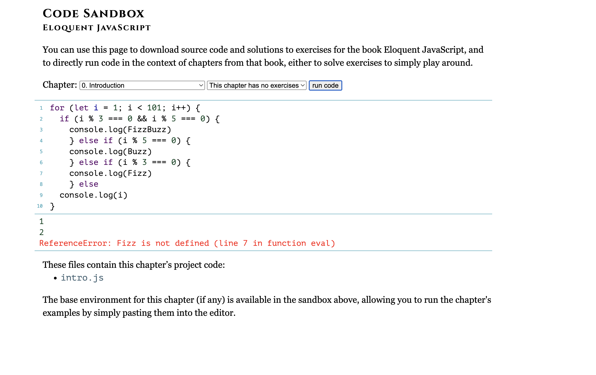
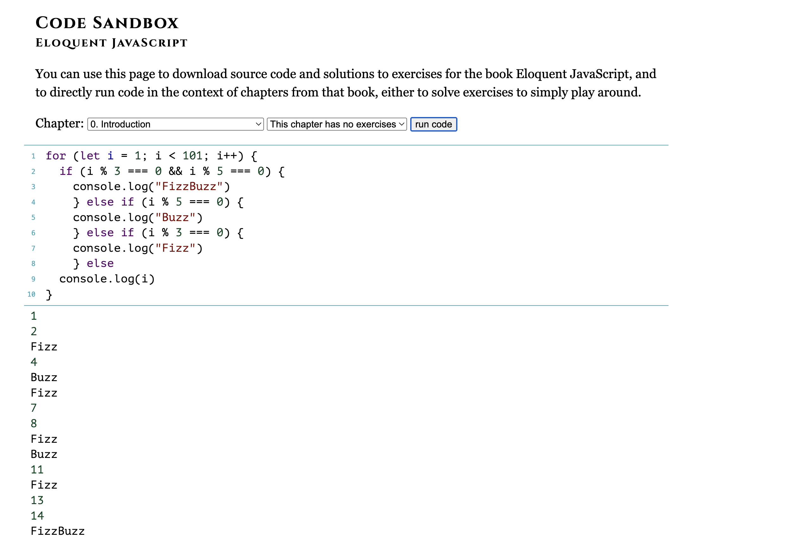

# FizzBuzz on javaScript

##Thought Process
1) I am counting from 1-100: I need to 'let' i be 1 instead of 0; I need to make i < 100 instead of 100; I am having 'i++' as I am adding one for each count)

2) Three conditions: divisable by 5; divisable by 3; divisable by both 5 and 3 

3) How to express divisable: Modulus = 0. Therefore, i % 5 === 0

4) What is the order of condition? How to avoid truncation? Which is the harder condition to fullfill? It will be 'both 3 & 5' one. 

Result: 
` for (let i = 1; i < 101; i++) { `
	
`   if (i % 3 === 0 && i % 5 === 0) { `
		
` 		console.log("FizzBuzz") `
	
`		} else if (i % 5 === 0) { `
		
`		console.log("Buzz") `
		
`		 } else if (i % 3 === 0) { `

`		console.log("Fizz") `
	
`		} else `

`	console.log(i) `

`} `

##Debugging
First Attempt: Realizing I forgot to add quotation for FizzBuzz, Fizz and Buzz. 

Result: 
